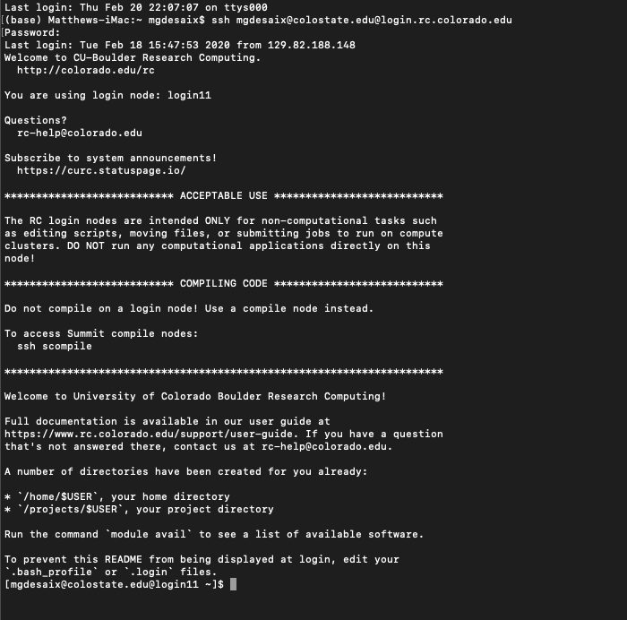

<!-- The following few lines just change some font sizes and colors and give us horizontal scrolling code and output boxes -->
<style type="text/css">
h1.title {
  font-size: 38px;
  color: DarkRed;
}
h1 { /* Header 1 */
  font-size: 20px;
  color: DarkBlue;
}

h2 { /* Header 2 */
  font-size: 18px;
  color: DarkBlue;
}
pre code, pre, code {
  white-space: pre !important;
  overflow-x: scroll !important;
  word-break: keep-all !important;
  word-wrap: initial !important;
}
</style>
<!-- Don't edit the stuff above here -->

Please submit code answers in the fenced `sh` code blocks below
each question/request below.  Note that these code blocks are not
intended to be evaluated in the Notebook.  Just include the code that
you wrote to solve each problem, by copying it into the block, but
evaluate the code in Terminal, or in the RStudio Git Bash terminal.
**Do Not** print the resulting output unless asked to, as
some of the outputs might be quite a lot of text.

But, do preview the notebook when you are done, and commit the updated nb.html file.

# Make sure you can login to a remote cluster

We are nearing the part of our course when we are going to get very familiar with
working on remote computers.  Everyone needs to have an account on a cluster.  UCSC
students can use hummingbird.  CSU grad students can use Summit.  Information about
these systems can be found [here](https://eriqande.github.io/eca-bioinf-handbook/working-on-remote-servers.html#accessing-remote-computers).

Get yourself an account an be sure you can login to it.  

## To show that you can login to your account, take a picture (a screen grab) of your session showing your login command (so we can see that it is you!) and the welcome screen of the cluster.  Save that screen grab into `./inputs/screen-grab.png` so it renders in a picture here. (You need to replace the currently existing `./inputs/screen-grab.png`, which shows the picture for my login to Summit).




# Writing scripts, variables, etc.

## Write a shell script called `my-script.sh`

Put the script in `scripts/my-script.sh` and commit it (so it will get pushed
back to GitHub when you push it).  Make sure that it is
executable.  Use the first 26 lines of `clone-classroom-repos.sh` from the handbook
to make a `usage` function that is printed if the `my-script.sh` is called with
more or less than 2 positional parameters.

The script should work like this: you pass in your name as a quoted string and also
the animal you work on, and it prints back a sentence, so it looks like:
```sh
% my-script.sh  "Eric C. Anderson"  salmon

My name is Eric C. Anderson. In my research I work on salmon

```

Show what happens when you execute it by copying and pasting your
command line and output into the fenced block below:
```sh
My name is Matt DeSaix and I work on birds
```

# Assigning variables from lines of output

Look at the file `inputs/sample_list.txt`.  This has information
that we would typically like to use to create read group information
while aligning sequences.

Here is a script that will pick out a line with index `i` from that
file and print it to _stdout_:
```sh
# this just says which line/index to get
i=3; 

# this is the awk one-liner that picks it out and prints it
awk -v L=$i '$1==L {print; exit}' inputs/sample_list.txt
```
Try running the above to see what it does and how it works. Then...

## Capture the output of the above into an array variable called SAMPARRAY
```sh
SAMPARRAY=(`awk -v L=$i '$1==L {print; exit}' inputs/sample_list.txt`)
```

## Now, pick out the appropriate elements of SAMPARRAY into five new variables: SAMPLE, LIBRARY, FLOWCELL, FQ1, and FQ2.  Print those new variables, using `echo`.  Show your code and output in the following block.
```sh
% i=4
% SAMPLE=${SAMPARRAY[1]}
% LIBRARY=${SAMPARRAY[2]}
% FLOWCELL=${SAMPARRAY[3]}
% FQ1=${SAMPARRAY[4]}
% FQ2=${SAMPARRAY[5]}
% echo ${SAMPLE}
fish-2
% echo ${FQ1}
bb22_1.fg.gz
% echo ${FQ2}
bb22_2.fg.gz
```

**Here is another approach **:   

Another way that those five variables above could be set, is to make a command
line directly in `awk` and then evaluate it in bash. For example:
```sh
awk -v L=$i '$1==L {print "SAMPLE=" $2 "; LIBRARY=" $3 "; FLOWCELL=" $4 "; FQ1=" $5 "; FQ2=" $6; exit}' inputs/sample_list.txt
```

## Write a block of code that evalautes the above, puts the result on the command line and then properly executes the variable assignments implied in the output.  Remember the `eval` keyword.
```sh
% i=3
% eval `awk -v L=$i '$1==L {print "SAMPLE=" $2 "; LIBRARY=" $3 "; FLOWCELL=" $4 "; FQ1=" $5 "; FQ2=" $6; exit}' inputs/sample_list.txt`
% echo ${SAMPLE}
fish-2
% echo ${FQ1}
bb11_1.fg.gz
% echo ${FQ2}
bb11_2.fg.gz
```

## Which approach do you find cleaner and easier to read?
```
I find the second approach cleaner because all the variables are being assigned in the same line and makes it less likely I'll make an error when assigning them.
```

# Grouped commands

We are interested in catenating the file `sample_list.txt` twice, with a line of zzzzz's between (so the series of commands would look like: `cat inputs/sample_list.txt; echo zzzzzzzzzzz; cat inputs/sample_list.txt` )

## Group those three commands using parentheses and redirect the output to a file called `paren-grouped.txt`
```sh
(cat inputs/sample_list.txt; echo zzzzzzzzzzz; cat inputs/sample_list.txt) > paren-grouped.txt
```

## Group those three commands using curly braces and redirect the output to a file called `curly-grouped.txt`
```sh
{ cat inputs/sample_list.txt; echo zzzzzzzzzzz; cat inputs/sample_list.txt; } > curly-grouped.txt
```

## What is the difference between these two grouping methods?
```
Grouping commands inside curly braces means all the commands are evaluated within the current shell.  Grouping commands into parentheses makes all the commands evaluated in a separate subshell.  I don't think this made a difference for what we did since we weren't assigning variable values.
```

# Tests and combinations of exit statuses

The `test` function tests statements (or _expressions_) and then returns SUCCESS if
the statement is true and NO_SUCCESS otherwise.  A shorthand for the `test` function
is a pair of square brackets, like this:
```sh
[ expression ]
```
Read the manual page (`man test`) to see what kinds of tests are possible.

## Assign the value `./inputs/sample_list.txt` to FILE
```sh
% FILE="./inputs/sample_list.txt"
```

Now, `[ -f $FILE ]` returns SUCCESS if $FILE exists and is a regular file.  


## Use `[ -f $FILE ]` and the `&&` to make a command line that prints "Yes, the file, $FILE, exists" if the file does exist and is a regular file. Show it in action on FILE
```sh
% [ -f $FILE ] && echo "Yes, the file, $FILE, exists"
```

## Use `||` to print "No, $FILE does not exist" when it does not.  First run it while `FILE=./inputs/sample_list.txt`, then set FILE to a path that does not exist
```sh
% [ -f $FILE2 ] && echo "Yes, the file, $FILE, exists" || echo "No, $FILE does not exist"
```

That is all well and good, but it would be nice to have a single
series of statements that would print the affirmative ("Yes, the file, $FILE, exists")
when true, and also the negative ("No, $FILE does not exist") when true...

## Use if/then/else/fi to test for the existence of $FILE and then print the appropriate response if it exists or not
```sh

```


# Dealing with large numbers of files. Combining exit statuses, etc. 

The goal here is to copy a large number of files that are in a few different
directories into a single directory, then cycle over them and apply a script 
to each.  Then print the results saved in a file, but only if the script did
not fail.

## `cd` from your home directory to the repository directory if you are not already in it

```sh
cd ./
```

## Recursively list all the contents of the `data_dump` directory

```sh
ls -R ./data_dump
```
Yowzers that is a lot of files.  This is the directory structure
that Matt's Rosy Finch data came in.  These files are not actually
fastq files.  Each one just has the SHA1 hash of the file name.


## That Didn't give us quite what we wanted.  We want the full paths for each file.  Get that with the following:
```sh
find data_dump | awk '/\.fq$/'
```

## Holy Cow! How many files is that? Count them.  Show the code and the result
```sh
find data_dump | awk '/\.fq$/' | wc -l
```

896 files

## Assign all those filenames into a variable called FQFILES. Use command substitution with `$( )`.
```sh
FQFILES=(`find data_dump | awk '/\.fq$/'`)
```

## Cycle over the names in FQFILES (using `for`) and print just the directory name part of their names
```sh
for i in ${FQFILES[@]};do dirname ${i}; done
```

## What are the names of the distinct directories these files are in, and how many are there?  Figure this out by piping the result from the above command into the `uniq` command.  Show the output of this one (should be only 3 lines)
```sh
% for i in ${FQFILES[@]};do dirname ${i}; done | uniq
data_dump/ROFI3/H202SC19100113/raw_data
data_dump/ROFI2/H202SC19091397/raw_data
data_dump/ROFI1/C202SC19050157/raw_data
```

## Make a directory called `all_fastqs` at the top level of the directory
```sh
mkdir all_fastqs
```


## Cycle over the FQFILES (using `for`) and for each one print, on the same line, the full path of the file, followed by a space and then just the basename of the file. Use `echo` and command substitution with `$( )`.

Not sure if I'm using the command substitution with an array variable properly here. I had originally just used echo for the full name and basename separately.

```sh
% for i in ${FQFILES[@]};do file=($i `basename ${i}`); echo ${file[0]} ${file[1]}; done
```

## Do the same as the previous exercise, but add (in front of the basename of each file) the word `all_fastqs/` so that they all look like paths.  Below is an example of what the first few lines of output should look like:
```
data_dump/ROFI1/C202SC19050157/raw_data/s17N04030_USPD16103200-N709-AK394_H3LJCCCX2_L5_1.fq all_fastqs/s17N04030_USPD16103200-N709-AK394_H3LJCCCX2_L5_1.fq
data_dump/ROFI1/C202SC19050157/raw_data/s17N04030_USPD16103200-N709-AK394_H3LJCCCX2_L5_2.fq all_fastqs/s17N04030_USPD16103200-N709-AK394_H3LJCCCX2_L5_2.fq
data_dump/ROFI1/C202SC19050157/raw_data/s17N04030_USPD16103200-N709-AK394_H3LJCCCX2_L6_1.fq all_fastqs/s17N04030_USPD16103200-N709-AK394_H3LJCCCX2_L6_1.fq
```
Put your code here:
```sh
% for i in ${FQFILES[@]};do file=($i `basename ${i}`); echo ${file[0]} all_fastqs/${file[1]}; done
```


## Using the code from the previous exercise, but changing `echo` to `cp`, copy each file to within the `all_fastqs` directory. 

The code took way too long, not sure why.  In RStudio terminal window it kept automatically ^C out of the process leaving only 200 files.  I then ran it through terminal and it took probably a minute.
```sh
% for i in ${FQFILES[@]};do file=($i `basename ${i}`); cp ${file[0]} all_fastqs/${file[1]}; done
```
By the end of this, you should have 896 files in that `all_fastqs` directory.


## Now, define a new variable called FASTQS that holds the paths of all the `.fq` files in the directory `all_fastqs`. Do it just with path expansion
```sh
FASTQS=`ls ./all_fastqs/*.fq`
```


## Hard problem:

There is a script in `scripts` called `random-fail.sh`.  It prints the number of digits in the first column of the first row of a file. I want you to cycle over the files in `all_fastqs`, redirecting _stderr_ to _append_ to a single file called `error-messages.txt` (this file should be removed before you start cycling over the FASTQS) and also redirecting standard output from `random-fail.sh` into a file that has the same name as the one from `all_fastqs1` but with `.gz` replaced by `.counts`. That is when you run the script like:
```sh
./scripts/random-fail.sh all_fastqs/s18N03747_USPD16103199-N704-AK400_H3LJCCCX2_L4_2.fq
```
I want the output to go into a file called:
```sh
all_fastqs/s18N03747_USPD16103199-N704-AK400_H3LJCCCX2_L4_2.counts
```
After that, cat the contents of the `.counts` file,
_but only if the_ `random-fail.sh` _script did not fail on that particular file_.  (`random_fail.sh` fails some fraction of the time, randomly, and when it does it returns a non-zero exit status).

So, at the end, you should have a lot of files like:
```
all_fastqs/s18N03747_USPD16103199-N704-AK400_H3LJCCCX2_L4_2.counts
```
and you should have a file, `error-messages.txt`, that contains all the
messages written to _stderr_ each time `random-fail.sh` failed. Also,
you should never have tried to `cat` a `.counts` file that did not exist.

```sh

```

## When you are done with that, print the lines in error-messages.txt
```sh

```

